[![Forks][forks-shield]][forks-url]
[![Stargazers][stars-shield]][stars-url]
[![Issues][issues-shield]][issues-url]
[![MIT License][license-shield]][license-url]
[![LinkedIn][linkedin-shield]][linkedin-url]

<!-- PROJECT LOGO -->
<br />
<p align="center">
  <a href="https://github.com/ParrotStone/Tabib-Website">
    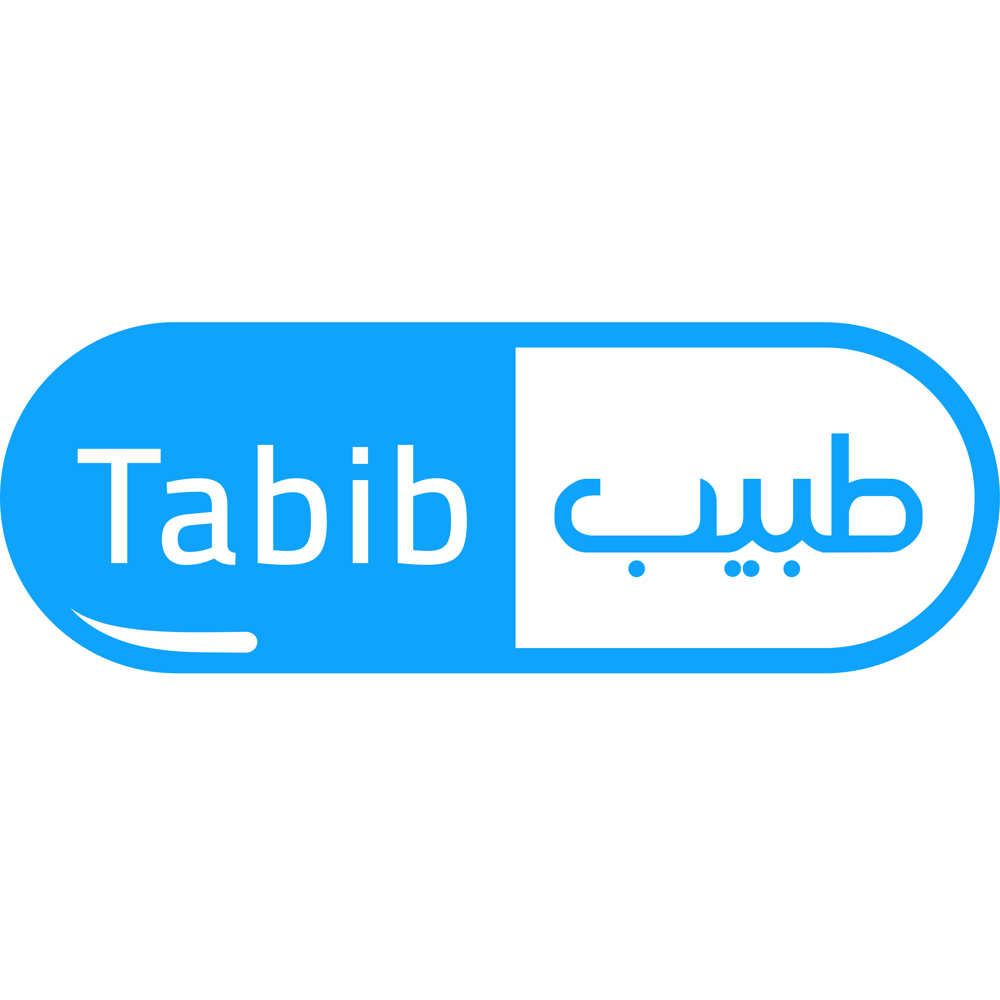
  </a>

  <h2 align="center">Tabib Web Application</h2>

  <p align="center">
    The front-end web application to the Tabib app where you can get your diagnosis :)
  </p>
</p>

<!-- Table of content -->

## Table of Contents

- [About the Project](#about-the-project)
  - [Built With](#built-with)
- [Getting Started](#getting-started)
  - [Prerequisites](#prerequisites)
  - [Installation](#installation)
- [Screenshots](#screenshots)
- [Roadmap](#roadmap)
- [Contributing](#contributing)
- [License](#license)
- [Contact](#contact)

<!-- About the project -->

## About The Project


Tabib web app was designed to help users find reliable diagnosis to their queries. It can also analyze images and predict the skin disease while also providing more info on the disease itself, its treatments, symptoms, etc. The web app user interface was designed to be accessible, easy to use, it emphasizes UX concepts in mind to provide an easy and beautiful experience to our users.

The web app also provides a density map to COVID-19 cases in Egypt with its different governorates. It also provide a Drug Alarm feature that allows the users to set time(s) to take their medications.

### Built With

This app was built using the following technologies:

- [Bootstrap](https://getbootstrap.com)
- [JQuery](https://jquery.com)
- [Material-UI](https://material-ui.com/)
- [React](https://reactjs.org)
- [RxJS](https://rxjs.dev/)

It uses React state and prop drilling for app-level state with hooks. Axios for the data fetching. React Router for routing.

## Getting-Started

The instructions below show how you can install and run the project

### Prerequisites

You need both [NodeJS](https://nodejs.org) and [NPM](https://npmjs.org) installed.

### Installation

1. Clone the repo

```sh
  git clone https://github.com/ParrotStone/Tabib-Website.git
```

2. Install `Yarn` package manager

```sh
  npm install -g yarn
```

3. Navigate to the project directory and type the following commands:

- Install the project dependencies

```sh
yarn install
```

4. Edit the file `config.js` in the `src` folder and add their respective API urls

5. You can then either run the project or build it for deployment

- Runs the app in the development mode - Open http://localhost:3000 to view it in the browser.

```sh
  yarn start
```

- Builds the app for production to the build folder.

```sh
  yarn build
```

<!-- Screenshot examples -->

## Screenshots

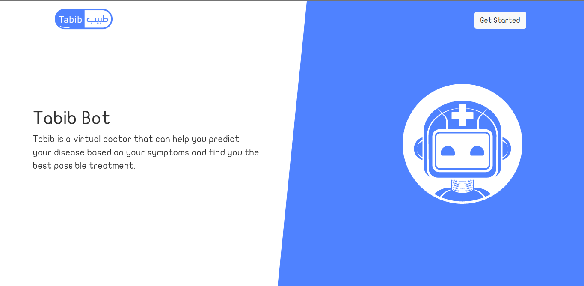

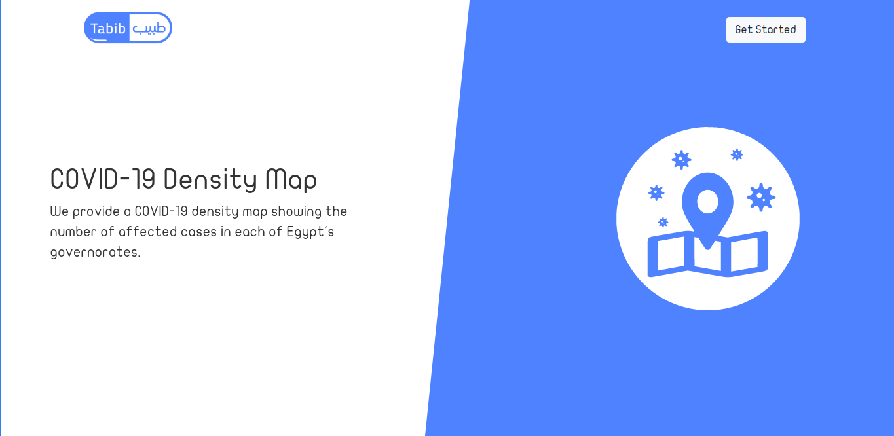

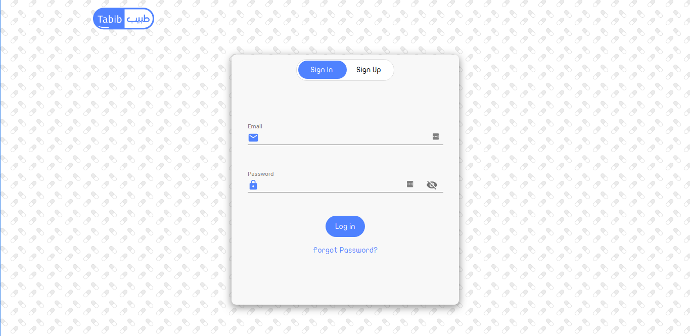

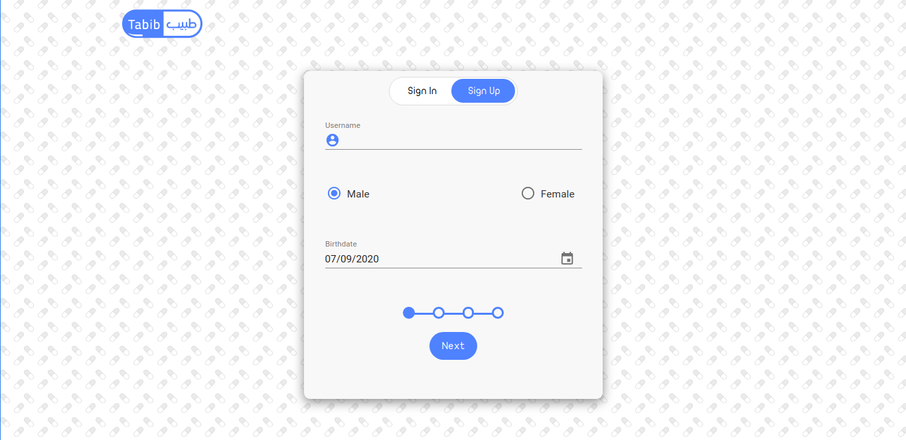

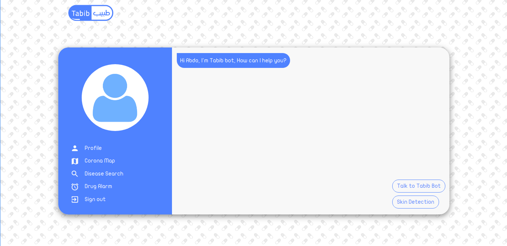

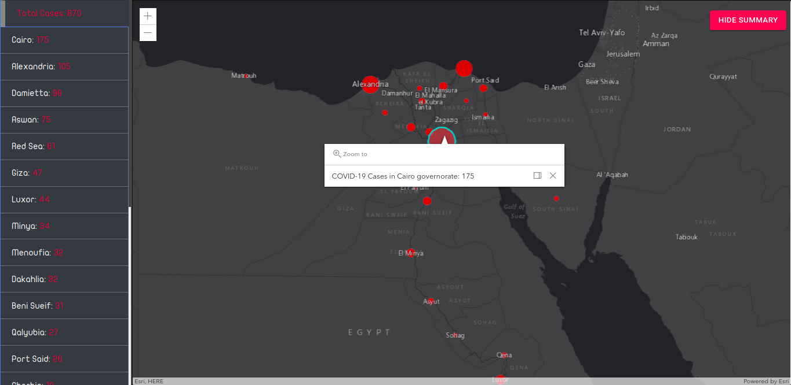

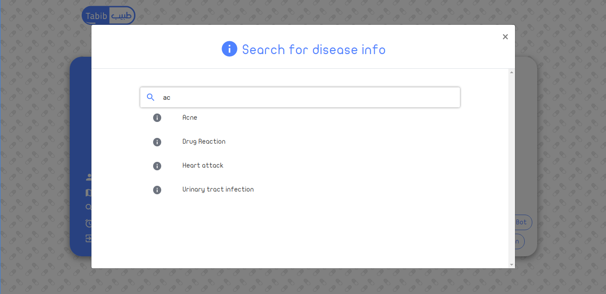

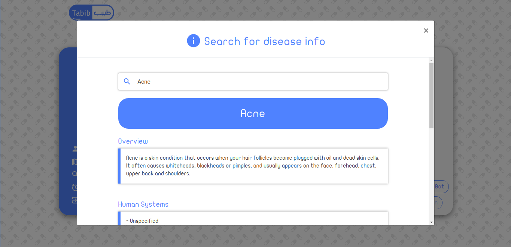

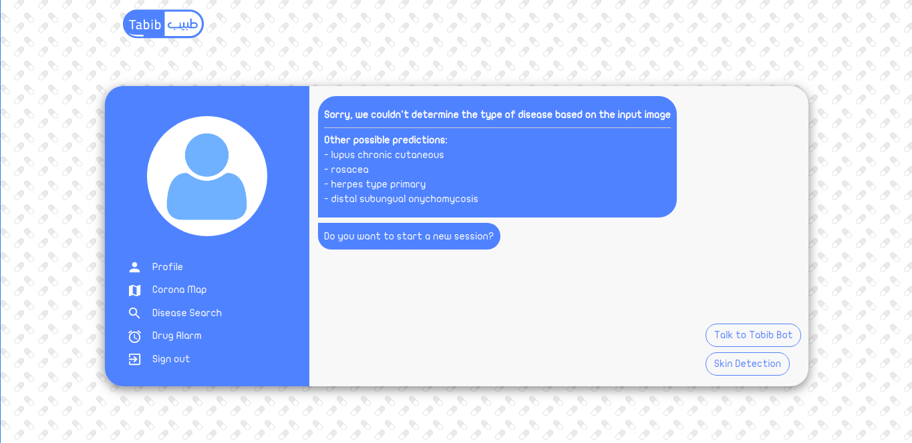

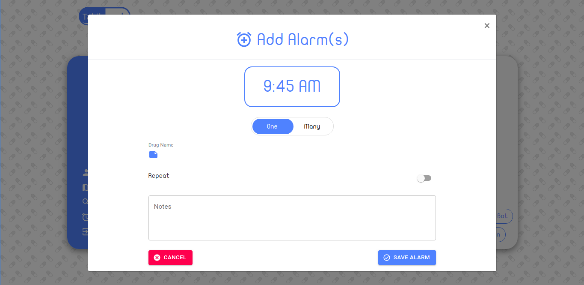

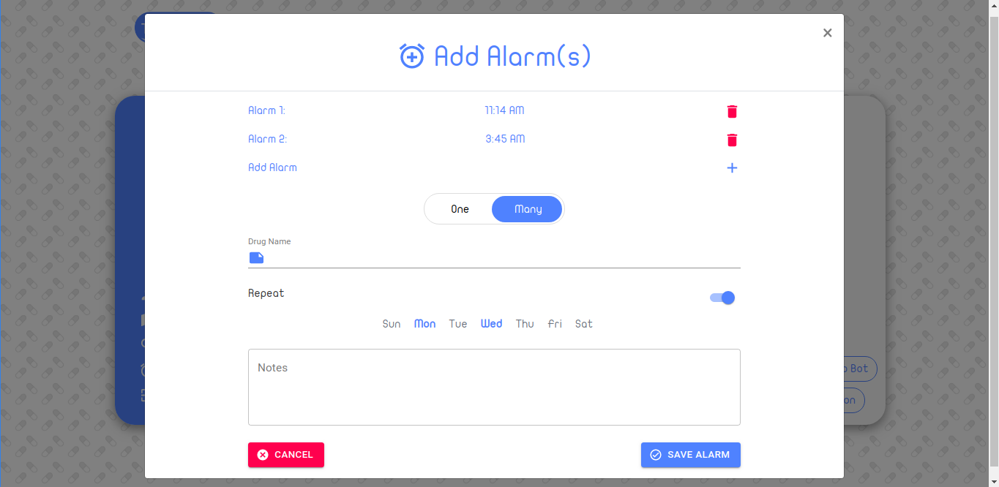

<!-- Roadmap -->

## Roadmap

See the [open issues](https://github.com/parrotstone/tabib-website/issues) for a list of known bugs and suggested/intended-fixes and features.

<!-- CONTRIBUTING -->

## Contributing

Contributions are what make the open source community such an amazing place to be learn, inspire, and create. Any contributions you make are **greatly appreciated**.

1. Fork the Project
2. Create your Feature Branch (`git checkout -b feature/AmazingFeature`)
3. Commit your Changes (`git commit -m 'Add some AmazingFeature'`)
4. Push to the Branch (`git push origin feature/AmazingFeature`)
5. Open a Pull Request

<!-- LICENSE -->

## License

Distributed under the MIT License. See `LICENSE` for more information.

<!-- CONTACT -->

## Contact

Abdulrahman Ali - [Twitter](https://twitter.com/abdoalihuss) - [Email](mailto:ParrotStone@gmail.com)

Project Link: [https://github.com/parrotstone/tabib-website](https://github.com/parrotstone/tabib-website)

[contributors-shield]: https://img.shields.io/github/contributors/parrotstone/tabib-website.svg?style=flat-square
[contributors-url]: https://github.com/parrotstone/tabib-website/graphs/contributors
[forks-shield]: https://img.shields.io/github/forks/parrotstone/tabib-website.svg?style=flat-square
[forks-url]: https://github.com/parrotstone/tabib-website/network/members
[stars-shield]: https://img.shields.io/github/stars/parrotstone/tabib-website.svg?style=flat-square
[stars-url]: https://github.com/parrotstone/tabib-website/stargazers
[issues-shield]: https://img.shields.io/github/issues/parrotstone/tabib-website.svg?style=flat-square
[issues-url]: https://github.com/parrotstone/tabib-website/issues
[license-shield]: https://img.shields.io/github/license/parrotstone/tabib-website.svg?style=flat-square
[license-url]: https://github.com/parrotstone/tabib-website/blob/master/LICENSE.txt
[linkedin-shield]: https://img.shields.io/badge/-LinkedIn-black.svg?style=flat-square&logo=linkedin&colorB=555
[linkedin-url]: https://linkedin.com/in/abdulrahman-ali
